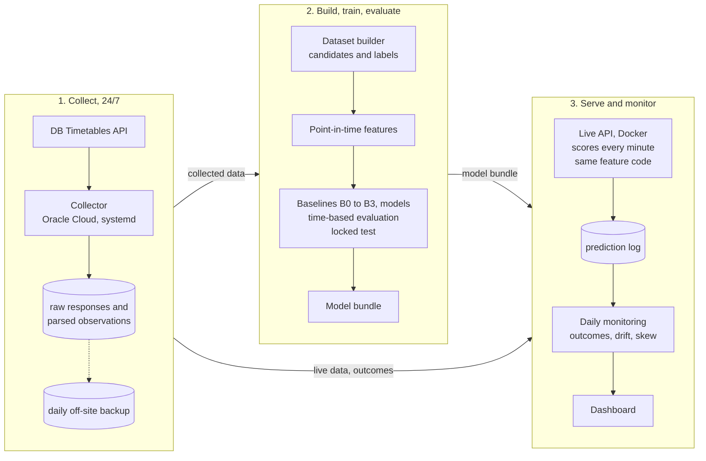

# NRW Connection Risk

[](https://github.com/wassimomabrouk/nrw-connection-risk/actions/workflows/ci.yml)

**Can live network data predict a missed train connection better than Deutsche Bahn's own prognosis?**

At five NRW rail hubs (Köln Hbf, Düsseldorf Hbf, Duisburg Hbf, Essen Hbf, Aachen Hbf), the project predicts for every plausible transfer whether it will fail, 60, 30 and 10 minutes before the arriving train is due, from data collected live from the DB Timetables API. The benchmark is DB's own prognosis turned into a probability (B3), so the model only counts as useful if it adds information DB does not already use.

**Status: work in progress.** The system runs end to end in production: data collection, a live prediction API and daily monitoring. The model is selected on validation data in November and evaluated once on a locked test period in December; until then the API serves a stand-in model and no performance claim is made.

## The problem in numbers

From the first collected day (2026-09-24; re-estimated on the full training period later):

- About **36,000 transfer candidates per day** across the five hubs, derived from the timetable with seven journey-planner rules ([DESIGN.md](DESIGN.md) section 1).
- **22% of them fail**: 16.6% because of delays, 5.5% because a train is cancelled.
- DB's prognosis is strong but incomplete. When DB's numbers imply a missed connection 30 minutes ahead, it is right 84% of the time, but it flags only **57% of the connections that actually fail** (39% at 60 minutes).
- A first exploration locates the missing information in the **network state** (delays of other trains on the same line and at the hub), not in the train's own delay trend.

## Status

| Stage | Status |
|---|---|
| Feasibility study on the public historical data ([FEASIBILITY.md](FEASIBILITY.md)) | done: labels unusable, own collector needed |
| Data collector (Oracle Cloud, systemd, daily off-site backup) | running since 2026-09-24 |
| Design: prediction unit, label, baselines, metrics, time-based splits ([DESIGN.md](DESIGN.md)) | decided, pre-registered |
| Dataset builder, point-in-time features with leakage tests, training and evaluation pipeline | done |
| Live prediction API (FastAPI, Docker, CI) | running, stand-in model |
| Daily live monitoring and dashboard (outcomes, drift, training/serving skew) | running |
| Feature selection (e06), rule committed before the data existed | runs after 14 October |
| Upstream feeder stations as features (e07) | data collected, decided early November |
| Model selection on validation (9 to 22 November) | November |
| Locked test (23 November to 12 December), evaluated once | December |
| Robustness after the timetable change of 13 December | December |

## How it works



What keeps the comparison honest:

- **Pre-registration.** Design decisions, expected results and the feature-selection rule are written into [DESIGN.md](DESIGN.md) and committed before the data that tests them exists; later changes go into its change log with a reason.
- **No look-ahead.** Every feature uses only what the collector had seen at the prediction moment. Tests replace all data after a point in time and check that no earlier feature changes, and were checked against deliberately injected leaks.
- **A strong benchmark.** B3 uses DB's prognosis with the same model class and settings as the model, so a gain measures new information, not a better algorithm.
- **A locked test.** The test period cannot be read without an explicit flag, and every evaluation of it is logged in git.
- **Training equals serving.** The live API computes features with the training code; a test and a daily check on production traffic compare the two value by value.

## Why a custom collector

A feasibility study on the public historical dataset showed that about 35 to 40% of its delay labels are prognoses recorded before the train arrived, not observed times, and that DB's prognosis cannot be reconstructed at fixed lead times because stations were polled only about five times per day. Details: [FEASIBILITY.md](FEASIBILITY.md).

The project therefore collects its own data from the DB Timetables API: recent changes every minute at the five hubs (every two minutes at 12 upstream stations), the full change state every 30 minutes, and hourly timetable slices, within the free plan's limit of 60 requests per minute. Operations: [docs/OPERATIONS.md](docs/OPERATIONS.md).

## Repository structure

```
config/collector.toml            stations, polling intervals, storage settings
config/dataset.toml              candidate rules, cutoffs and data-quality thresholds for the dataset
config/features.toml             feature groups in use, hub-state settings, holidays
config/training.toml             splits, models, calibration, evaluation settings
config/feature_selection.toml    pre-registered rule and window of the feature selection (e06)
config/serving.toml              live service: data paths, scoring interval, prediction log
config/monitoring.toml           daily evaluation of the live predictions, drift thresholds
src/nrw_connection_risk/
    collector/                   API client, XML parsing, storage, scheduler, health checks
    dataset/                     transfer candidates, point-in-time state, labels (training table)
    features/                    point-in-time features, shared by training and live prediction
    training/                    baselines B0-B3, models, calibration, time-based evaluation, test lock, feature selection, model bundle
    serving/                     live scoring every minute and the FastAPI service
    monitoring/                  daily live evaluation against observed outcomes, drift (PSI), skew check, dashboard
tests/                           unit and integration tests (pytest)
tools/                           API smoke test, collection status, raw-to-parsed rebuild, feeder selection
deploy/                          systemd units for the collector, the daily backup and the daily monitoring
Dockerfile, compose.yml          container for the API
.github/workflows/ci.yml         tests on Python 3.11 and 3.14, image build and smoke test
docs/                            operations runbook, dataset card, feature card, training and evaluation, serving, monitoring
exploration/                     exploration scripts e01 to e05 and their reports (e06 reports are written here too)
section0/                        feasibility scripts on the historical dataset
```

## Setup

Requires Python 3.11 or newer and a free DB API Marketplace application subscribed to the Timetables API.

```
python -m venv .venv
.venv\Scripts\activate          (Linux: source .venv/bin/activate)
pip install -e ".[dev]"
copy .env.example .env          (Linux: cp .env.example .env), then add your keys
pytest
```

## Running the collector

```
python -m nrw_connection_risk.collector.main                  run until stopped
python -m nrw_connection_risk.collector.main --duration-min 15
python tools/collector_status.py                              summary of collected data
```

Data is written to `data/collector/`: raw API responses as gzip JSON lines (`raw/`), parsed observations as Parquet (`parsed/`), a heartbeat file and logs.

## Building the training dataset

```
python tools/rebuild_parsed.py --raw data/restore/raw --out data/restore --replace
python -m nrw_connection_risk.dataset.build --parsed data/restore/parsed --from 2026-09-24 --to 2026-09-30
```

One Parquet table per service day: every transfer candidate at the five hubs, DB's prognosis as known 60, 30 and 10 minutes before arrival, and the observed outcome. Details: [docs/DATASET.md](docs/DATASET.md).

## Building the features

```
python -m nrw_connection_risk.features.build --from 2026-09-24 --to 2026-09-30
```

Six feature groups (DB prognosis, hub state, freshness, context, trend, messages) for every eligible row. The functions are pure and will also serve live predictions; tests rewrite all data after a point in time and check that no earlier feature changes. Details: [docs/FEATURES.md](docs/FEATURES.md).

## Training and evaluation

```
python -m nrw_connection_risk.training.evaluate --mode cv
```

Compares the timetable, a historical rate, DB's own rule and DB's prognosis turned into a probability (B3, the headline baseline, gradient boosting on DB's four numbers) against the models, with confidence intervals from resampling whole days. The test period is locked in code and every evaluation of it is logged. Details: [docs/TRAINING.md](docs/TRAINING.md).

```
python -m nrw_connection_risk.training.feature_selection
```

Decides the feature groups once, with the rule pre-registered in DESIGN.md section 3.

## Live predictions

```
python -m nrw_connection_risk.training.fit_bundle --model gbm
uvicorn nrw_connection_risk.serving.api:create_app_from_env --factory --port 8000
```

Every minute, all upcoming connections at the five hubs get a failure probability from the model and from the DB baseline (B3), computed with the same feature code as training; a test checks that live and offline features are identical. Predictions at the 60, 30 and 10-minute marks are logged for monitoring. Runs in Docker next to the collector. Details: [docs/SERVING.md](docs/SERVING.md).

## Monitoring

```
python -m nrw_connection_risk.monitoring.daily
```

Every morning the server labels the previous day's logged predictions with the dataset builder (the same labels as training) and scores the model, B3 and the DB rule on live traffic. It also compares every input with the training data (population stability index), recomputes each logged prediction's features offline to check that live and training features are identical, and reports coverage and data age. A dashboard in the API shows it all. Details: [docs/MONITORING.md](docs/MONITORING.md).

## Data source

Deutsche Bahn Timetables API via the DB API Marketplace. The historical analysis in `section0/` uses [piebro/deutsche-bahn-data](https://huggingface.co/datasets/piebro/deutsche-bahn-data) (CC BY 4.0).
